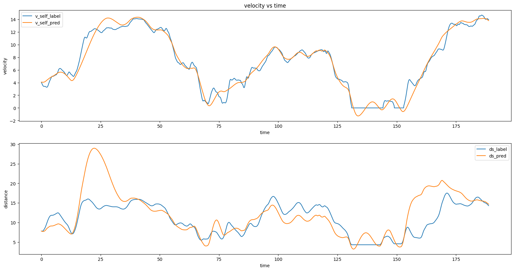

## IDM Model Simulation Using Genetic Algorithm

### Problem Statement
[WIKI page](URL)

### Dataset Sample
```csv
3.844477085	3.991764751	4.512393915	4.380150794	7.814862817	8.376395823	7.169008567
3.838882364	3.90607525	4.611320986	4.504225298	7.80013405	8.324332907	7.182232879
3.856314554	3.816075065	4.685234681	4.585342143	7.793414762	8.253808333	7.192942448
3.894274691	3.727296062	4.727834732	4.625355642	7.797438711	8.166892372	7.202931701
3.946709113	3.644907105	4.735197511	4.631719227	7.814136573	8.066838505	7.21317961
....
```
Refer to [Dataset README](./README_dataset.txt).

### Simple Run
```bash
pip3 install -r requirements.txt
```
```
python idm_model.py --data <Path/to/your/dataset> \
                    --car_id <car id (2 to 4)>
```

### Example Result


