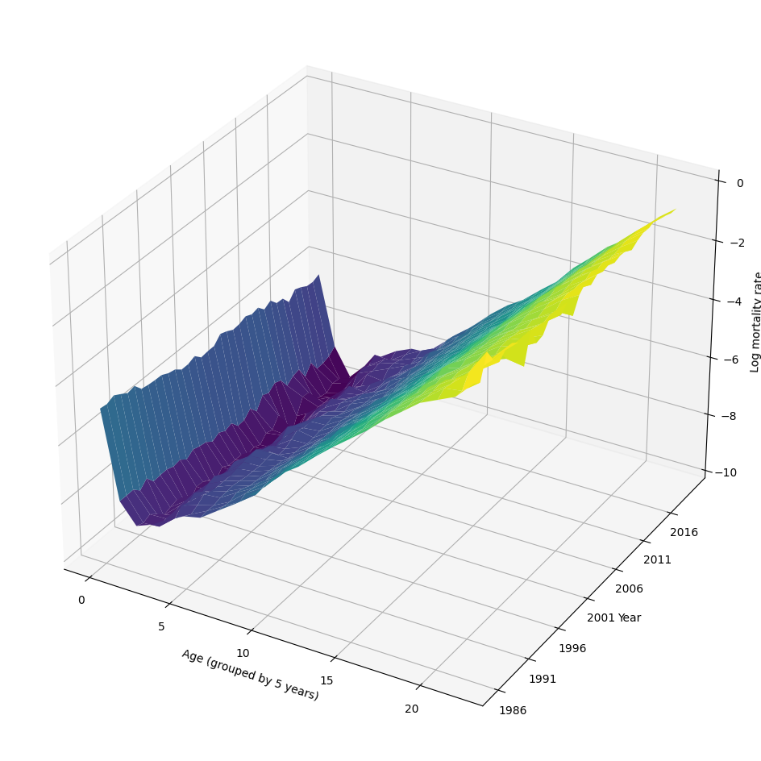
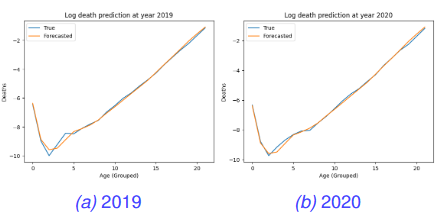

## About

Used Lee-carter model to fit the data from 1989 to 2018 and predict the modality rate for 2019 and 2020.

Model: [Lee-carter](https://en.wikipedia.org/wiki/Lee%E2%80%93Carter_model)

Dataset: [Hong Kong Modality Rate](https://en.wikipedia.org/wiki/Lee%E2%80%93Carter_model)

## Data visualization

## Prediction result

RMAE: 0.089

